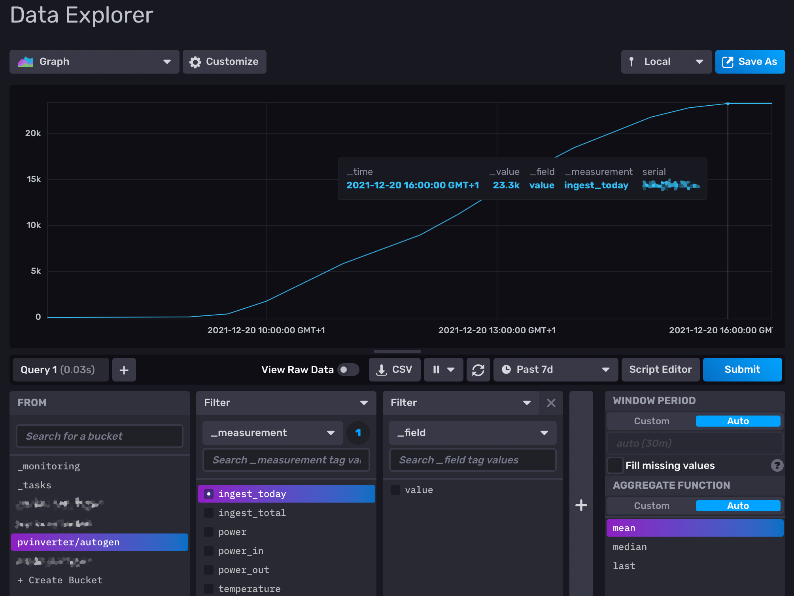

# sbfspot2influxdb
Write PV data from sbfspot2 to an InfluxDB v2

My environment:

- Raspberry Pi 3 Model B Rev 1.2
- Raspbian 32 bit
- Installed sbfspot
  - [Official documenation](https://github.com/SBFspot/SBFspot/wiki/Installation-Linux-SQLite)
  - `curl -s https://raw.githubusercontent.com/sbfspot/sbfspot-config/master/sbfspot-config` piped into bash
- An InfluxDB v2 bucket

sbfspot is called every 5 minutes by cron.

After running some time, the database can be checked running the following commands by user `pi`:

`% sqlite3 smadata/SBFspot.db 'select * from SpotData order by timestamp desc limit 1'`

```
% sqlite3 smadata/SBFspot.db 'select * from vwSpotData order by TimeStamp DESC limit 1'
2021-11-25 17:12:14|2021-11-25 17:10:00|SN: xxx|STP xxx|xxx|0|0|0.0|0.0|0.0|0.0|0|0|0|0.0|...|OK|N/A|0.0
```

You have to create an InfluxDB bucket first.

Using cron, the sbfspot2influxdb script can be run by cron (`crontab -e` for user pi):

`*/5 6-22 * * * /home/pi/sqlite2influx 1> /home/pi/sqlite2influx.log 2>&1`

Using that snippet, the script is called every 5 minutes, reading the latest 10 entries from the sqlite database, writing entries to InfluxDB. So you won't miss any data if the script wasn't called for some time.

The script runs from 6 am to 11 pm, same as sbfspot's daydata script.

(If you want to transfer all entries from the database to InfluxDB, please have a look at commit d2689d264458b257532c2da451dca27bf9aa034e - you have to remove the `limit 10` part)

Most fields from table SpotData are transferred to InfluxDB. See [table definition](https://github.com/rg-engineering/SBFspot/blob/2287f3a83c7b42b13c72be5ef59f6821a37dcfe0/SBFspot/CreateSQLiteDB.sql#L39).

Beginning 2021-12-26, I'm using InfluxDB v2.


How does it look like?
----------------------

Choosing ingest_today, it may look like this, showing an ingest (etoday) of 23 kWh for Dec 20th:


